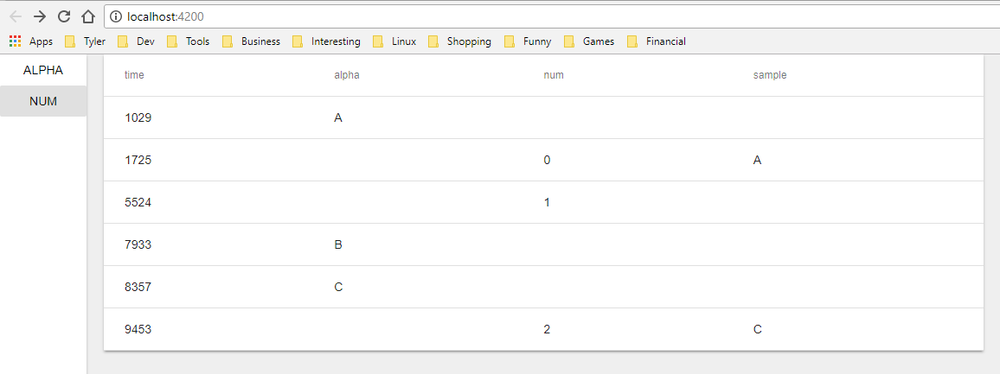

# rxjs-playground

rxjs-playground is a demo app for visualizing rxjs operators.



## install

```bash
git clone https://github.com/ryansheehan/rxjs-playground.git
cd rxjs-playground
npm install
```

## run

```bash
npm run start
```

## how to use

In [src/app/app.component.ts](https://github.com/ryansheehan/rxjs-playground/blob/master/src/app/app.component.ts), modify the setupPlayground() method
```typescript
private _alphaGen = this._generator('ABCDEFGHIJKLMNOPQRSTUVWXYZ'.split(''));
private _numGen = this._generator('0123456789'.split(''));
readonly alpha$ = new Rx.Subject<string>();
readonly num$ = new Rx.Subject<string>();

...

private setupPlayground() {
  // #####################################################
  // #
  // #       setup playground here
  // #
  // #####################################################

  // attach an observable to be rendered on the table
  // by assigning it to a new key in the streams object
  this.streams['sample'] = this.alpha$.sample(this.num$);

  // can attach functions to be executed with buttons on
  // the side bar by assigning the method to a key on 
  // the actions object.
  this.actions['alpha'] = this.pushAlpha;
  this.actions['num'] = this.pushNum;
}

...

pushAlpha() {
  this.alpha$.next(this._alphaGen.next().value);
}
pushNum() {
  this.num$.next(this._numGen.next().value);
}

private *_generator(characters: string[]): IterableIterator<string> {
  for (let i = 0; true; i = (i + 1) % characters.length) { 
    yield characters[i]; 
  }
}

```
